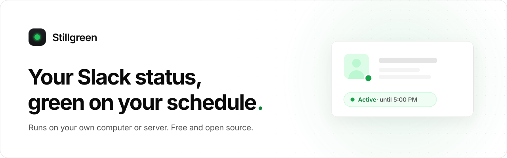
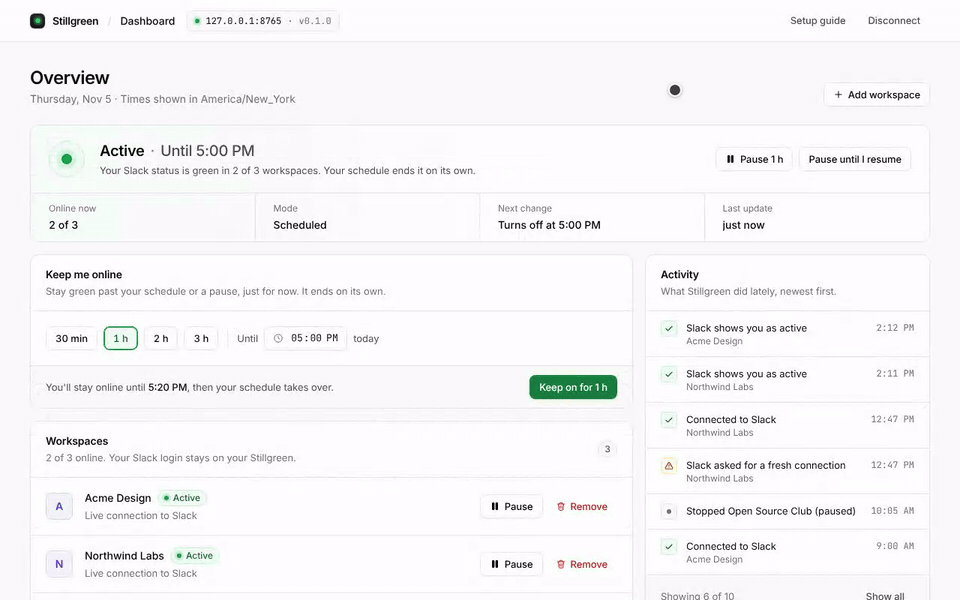
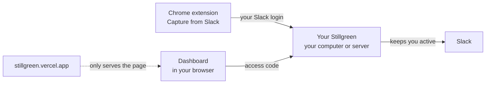
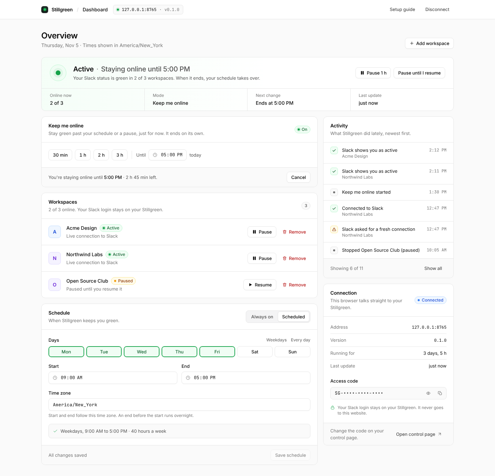
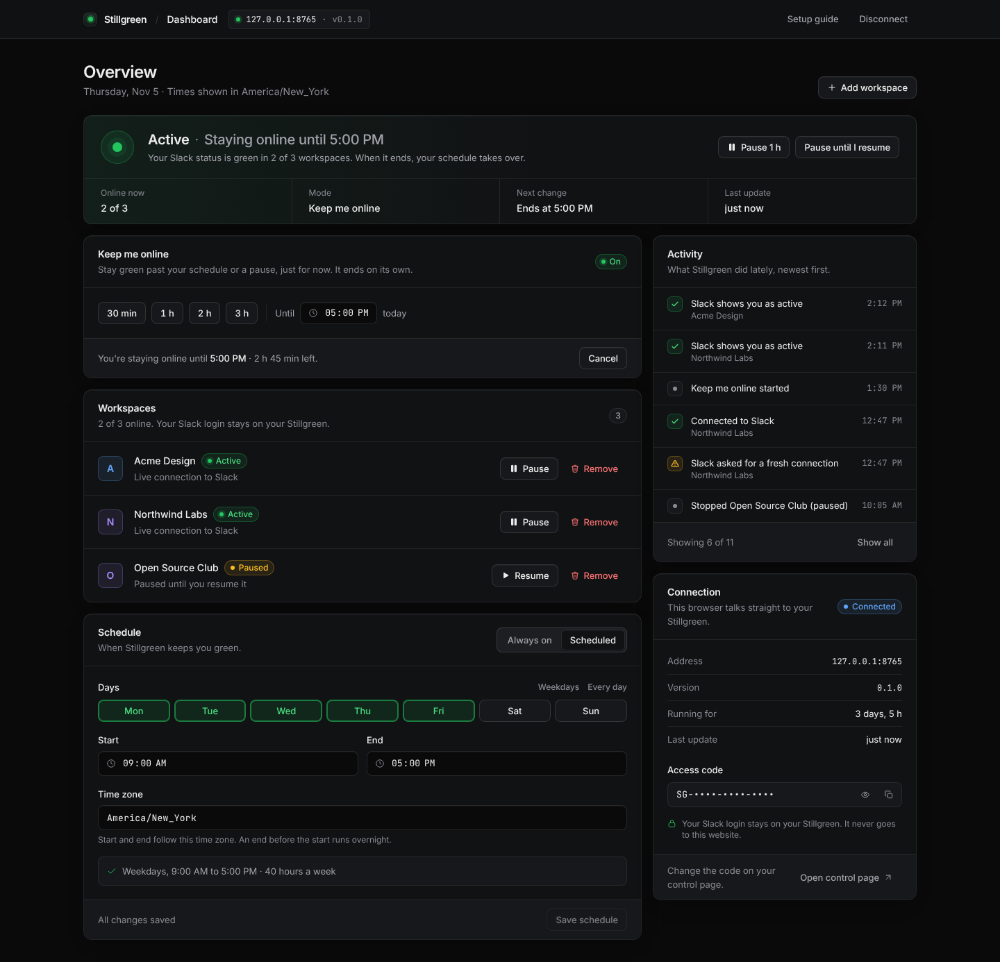
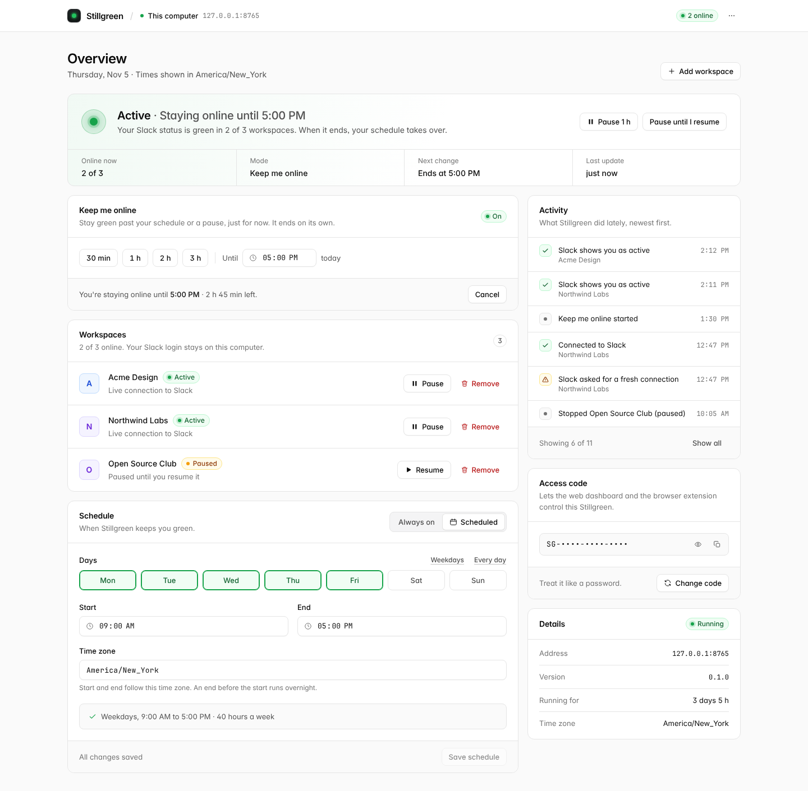
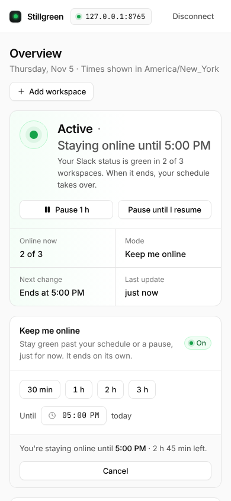
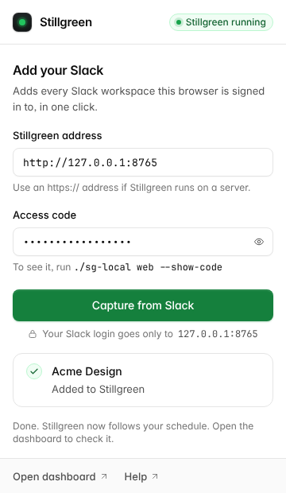

<p align="center">
  <picture>
    <source media="(prefers-color-scheme: dark)" srcset="docs/banner-dark.svg">
    
  </picture>
</p>

<p align="center">
  <strong>Keep your Slack status green, on your schedule.<br>Free, open source, and it runs on your own computer or server.</strong>
</p>

<p align="center">
  <a href="https://github.com/laxmideepak/Still-Green/actions/workflows/tests.yml"></a>
  <a href="LICENSE"></a>
  <a href="https://github.com/laxmideepak/Still-Green/stargazers"></a>
  
  <a href="#run-it-247-for-free"></a>
</p>

<p align="center">
  <a href="https://stillgreen.vercel.app"><strong>Website</strong></a> ·
  <a href="https://stillgreen.vercel.app/dashboard"><strong>Open dashboard</strong></a> ·
  <a href="#quick-start-5-minutes"><strong>Quick start</strong></a> ·
  <a href="#run-it-247-for-free"><strong>Run it 24/7 for free</strong></a> ·
  <a href="#faq"><strong>FAQ</strong></a>
</p>

<p align="center">
  
</p>

## Why Stillgreen

- **Slack marks you away too soon.** You step away for a few minutes, or your laptop goes to sleep, and your status turns grey.
- **Most fixes have a catch.** Paid "stay online" services keep your Slack login on their servers. Mouse jigglers only work while your computer is on and awake.
- **Stillgreen is free and private.** It runs on your own computer, or on your own small cloud server. Your Slack login is only ever sent to Slack.
- **You decide when.** Stay green all the time, or only on the days and hours you choose.

## Features

<table>
  <tr>
    <td width="33%"><strong>Always on or on a schedule</strong><br>Pick the days, the hours and your timezone.</td>
    <td width="33%"><strong>Keep me online</strong><br>Stay green for 30 min, 1 h, 2 h, 3 h, or until a time today.</td>
    <td width="33%"><strong>Pause any time</strong><br>For 1 hour or until you resume. Or pause just one workspace.</td>
  </tr>
  <tr>
    <td><strong>Many workspaces</strong><br>Add them all with one click in the browser extension.</td>
    <td><strong>Respects your "away"</strong><br>If you set yourself away in Slack, Stillgreen leaves it alone.</td>
    <td><strong>Reconnects by itself</strong><br>Checks every minute and reconnects if Slack marks you away.</td>
  </tr>
  <tr>
    <td><strong>Activity log</strong><br>See what Stillgreen did and when, newest first.</td>
    <td><strong>Light and dark theme</strong><br>On the dashboard and on Stillgreen's own control page.</td>
    <td><strong>Private by design</strong><br>Your login stays with you. The website never sees it.</td>
  </tr>
</table>

## How it works

1. **Start Stillgreen** on your computer, or on a small cloud server. It is one small Python program.
2. **Add your workspaces.** Open Slack in Chrome and click **Capture from Slack** in the Stillgreen extension.
3. **Set your schedule** in the dashboard. Stillgreen keeps a Slack connection open, like the Slack web app does, so Slack shows you as active.


```mermaid
flowchart LR
    ext["Chrome extension<br/>Capture from Slack"] -- "your Slack login" --> sg
    dash["Dashboard<br/>in your browser"] -- "access code" --> sg
    sg["Your Stillgreen<br/>your computer or server"] -- "keeps you active" --> slack["Slack"]
    site["stillgreen.vercel.app"] -. "only serves the page" .-> dash
```

The website only sends the dashboard page to your browser. After that, your browser talks straight to **your** Stillgreen. Your Slack login never goes to the website.

## Quick start (5 minutes)

**You need:** macOS or Linux, Python 3.11 or newer (check with `python3 --version`; if yours is older, get a new one from <https://www.python.org/downloads/>), and Chrome (or another Chromium browser, such as Edge or Brave).

**1. Download Stillgreen and start it**

```bash
git clone https://github.com/laxmideepak/Still-Green.git
cd Still-Green
python3 -m pip install --user websockets
./sg-local web --daemon --open
```

This starts Stillgreen in the background and opens its control page at <http://127.0.0.1:8765>. You can close the terminal; Stillgreen keeps running.

The page shows your **access code**. It looks like `SG-ABCD-EFGH-JKLM`. Lost it? Run `./sg-local web --show-code`.

Optional: run `./install.sh` so you can type `sg-local` from any folder instead of `./sg-local`.

**2. Add your Slack account with the extension**

1. In Chrome, open `chrome://extensions` and turn on **Developer mode** (top right).
2. Click **Load unpacked** and choose the `extension` folder inside `Still-Green`.
3. Click the Stillgreen icon in the toolbar (pin it from the puzzle-piece menu).
4. Leave **Stillgreen address** as `http://127.0.0.1:8765` and paste your **access code**. It is saved automatically.
5. Open <https://app.slack.com> in the same Chrome window and sign in.
6. Click **Capture from Slack**.

The workspace appears on the control page. Within a few seconds its status changes to **Active**.

<details>
<summary><strong>Prefer not to use the extension?</strong> Add the account by hand.</summary>

<br>

Run `./sg-local add` and paste two values when it asks. The input is hidden.

1. Open your workspace at <https://app.slack.com> in Chrome and sign in.
2. Open DevTools (`Cmd+Option+I` on Mac, `Ctrl+Shift+I` elsewhere) and go to the **Network** tab. Reload the page.
3. **Token:** type `api` in the filter box, click a request such as `client.boot`, and open **Payload**. Copy the `token` value. It starts with `xoxc-`.
4. **Cookie:** go to **Application → Cookies → https://app.slack.com** and copy the value of the cookie named `d`. It starts with `xoxd-`.

Both values must come from the same signed-in browser. Treat them like a password: never paste them into chat, issues, or screenshots.

More about the extension and its permissions: [extension/README.md](extension/README.md).

</details>

**3. (Optional) Connect the online dashboard**

Open <https://stillgreen.vercel.app/dashboard>, click **Connect Stillgreen**, and enter:

- **Stillgreen address:** `http://127.0.0.1:8765`
- **Access code:** the same code as before

Your browser remembers these, so you only do this once. You can also skip this and use the control page at <http://127.0.0.1:8765>. It has the same controls.

**That's it.** Your status stays green while Stillgreen is running.

> [!NOTE]
> On your own computer, Stillgreen stops when the computer sleeps or shuts down. To stay green when your laptop is closed, [run it in the cloud](#run-it-247-for-free).

## Run it 24/7 for free

Put Stillgreen on a small server that is always on, and you stay green even when your laptop is closed. Google Cloud's **e2-micro** server is free within its limits, and one setup script does the rest: Docker, Stillgreen and a free HTTPS address.

**On Google Cloud (about 15 minutes):**

1. Open <https://console.cloud.google.com/compute/instances> and click **Create instance**.
2. Pick **Region** `us-central1` (or `us-west1` / `us-east1`) and **Machine type** `e2-micro`.
3. Under **Boot disk**, click **Change** and pick **Standard persistent disk** (keep Debian and 10 GB). The default "Balanced" disk is **not** free.
4. Under **Firewall**, tick **Allow HTTP traffic** and **Allow HTTPS traffic**. Create the instance.
5. Click **SSH** next to the new instance, and run:

```bash
sudo apt-get update && sudo apt-get install -y git
git clone https://github.com/laxmideepak/Still-Green.git && cd Still-Green
sudo sh deploy/setup-vm.sh
```

The script prints your address and access code:

```text
  Address:      https://34-1-2-3.sslip.io
  Access code:  SG-ABCD-EFGH-JKLM
```

6. Use these two values in the dashboard (**Connect Stillgreen**) and in the extension, instead of `http://127.0.0.1:8765`. Then click **Capture from Slack** as usual.

<details>
<summary><strong>The full cloud guide:</strong> why a server, which server, your own domain, updates, and good to know</summary>

<br>

#### Why a server, and why not Vercel?

Stillgreen has to keep **one connection to Slack open all the time**. Vercel only runs short pieces of code that stop after a few minutes at most, so it can show the dashboard but cannot hold that connection. You need a small always-on server for Stillgreen. The dashboard stays on Vercel.

The server needs `https://`, because the dashboard is an `https://` page and browsers block it from talking to a plain `http://` server on the internet. The setup script gets a free HTTPS certificate automatically.

#### Which server?

| Option | Cost | Notes |
| --- | --- | --- |
| **Google Cloud e2-micro** (recommended) | Free | One small always-on server in the US regions us-west1, us-central1 or us-east1. Needs a card on file, but stays free within the limits. |
| **Oracle Cloud Always Free** | Free | Also works with the same steps. Free servers are sometimes not available in a region. |
| **Fly.io** | About $2-3 a month | Easiest to set up; HTTPS included. No free plan for new accounts. |
| **A computer at home** (Raspberry Pi, old laptop) | Free | Use the normal [Quick start](#quick-start-5-minutes); it must stay on. |

Free plans that put the server to sleep when no one visits (for example Render's free plan) do **not** work: a sleeping server drops the Slack connection.

#### Your own domain

The setup script makes an address from the server's IP, such as `https://34-1-2-3.sslip.io`. Have your own domain? Point it at the server and run this instead:

```bash
sudo sh deploy/setup-vm.sh stillgreen.example.com
```

#### Update to a new version

In the `Still-Green` folder on the server, run:

```bash
git pull && sudo docker compose up -d --build
```

#### If the address changes

The server's IP address (and so the `sslip.io` address) changes if you stop and start the server. Restarting it from inside (`sudo reboot`) keeps it. If it does change, run `sudo sh deploy/setup-vm.sh` again and update the Stillgreen address in the dashboard and the extension.

You can also keep the address with **VPC network → IP addresses → Promote to static**, but check **Billing** afterwards: a static address may cost a little.

#### Good to know

- Your Slack login is stored on your server, in a Docker volume only the Stillgreen user can read. It is never sent to the dashboard website.
- After 10 wrong access codes in a minute, the server refuses more tries from that visitor for a minute. Other visitors are not affected.
- Schedules saved from the dashboard use your browser's timezone, so "9 to 5" means your 9 to 5 even though the server runs on UTC.
- Slack may notice that your login is used from a cloud server and sign it out. If the status keeps showing **Signed out**, capture again. If it keeps happening, run Stillgreen at home instead.

</details>

<details>
<summary><strong>Fly.io</strong> (paid, about $2-3 a month)</summary>

<br>

Install the `fly` command (<https://fly.io/docs/flyctl/install/>), then in the `Still-Green` folder:

```bash
fly launch --copy-config --no-deploy --name your-stillgreen
fly volumes create stillgreen_data --size 1
fly deploy
fly ssh console -C "sg-local web --show-code"
```

The last command prints your access code. Your Stillgreen address is `https://your-stillgreen.fly.dev`.

</details>

<details>
<summary><strong>Any other Docker host</strong></summary>

<br>

With Docker Compose, Caddy sits in front of Stillgreen and gets the HTTPS certificate:

```bash
echo "STILLGREEN_DOMAIN=your.domain" > .env
docker compose up -d --build
docker compose exec stillgreen sg-local web --show-code
```

Without Compose, build and run the image alone, and put your own HTTPS proxy in front of port 8765:

```bash
docker build -t stillgreen .
docker run -d -p 127.0.0.1:8765:8765 -v stillgreen-data:/data stillgreen
```

</details>

## Screenshots

<table>
  <tr>
    <td width="50%"></td>
    <td width="50%"></td>
  </tr>
  <tr>
    <td align="center">Dashboard, light</td>
    <td align="center">Dashboard, dark</td>
  </tr>
</table>

<table>
  <tr>
    <td width="50%" align="center"></td>
    <td width="25%" align="center"></td>
    <td width="25%" align="center"></td>
  </tr>
  <tr>
    <td align="center">Stillgreen's own control page</td>
    <td align="center">On a phone</td>
    <td align="center">Chrome extension</td>
  </tr>
</table>

## Stillgreen vs other ways

| | **Stillgreen** | Paid "stay online" services | Mouse jigglers |
| --- | --- | --- | --- |
| **Price** | Free | Monthly fee | Free app, or a small device to buy |
| **Needs your computer on** | No, if you run it on a server | No | Yes, on and awake |
| **Who holds your Slack login** | You (your computer or your server) | The service | No login needed |
| **Schedules** | Yes: days, hours and timezone | Often | Usually not |
| **Respects an "away" you set** | Yes | Depends on the service | Does not know about Slack |
| **Open source** | Yes (MIT) | Usually not | Some are |

## Privacy and security

- **Your login stays with you.** It is stored on your computer or server in a file only your user can read (file mode `0600`). It is sent only to Slack and never written to logs.
- **The website never sees it.** The dashboard page talks from your browser straight to your Stillgreen.
- **Access code.** Stillgreen shows your status and changes settings only for someone with your access code. After 10 wrong codes in a minute, that visitor must wait a minute.
- **Locked to the right addresses.** A Host check blocks DNS rebinding (a trick where another website pretends to be your Stillgreen), and only the official dashboard address may use the API from a browser.
- **The extension is careful too.** It sends your login only to the Stillgreen address you set, and refuses plain `http://` addresses that are not on your own computer.

More in **Your data** under [Guides and reference](#guides-and-reference), and in [extension/README.md](extension/README.md).

## FAQ

<details>
<summary><strong>Is it free?</strong></summary>

<br>

Yes. Stillgreen is free and open source under the MIT license. Running it on your own computer costs nothing. Running it in the cloud can also be free (see below).

</details>

<details>
<summary><strong>Does my computer need to stay on?</strong></summary>

<br>

Only if you run Stillgreen on your computer. It stops when the computer sleeps or shuts down. To stay green with your laptop closed, [run it on a free cloud server](#run-it-247-for-free).

</details>

<details>
<summary><strong>Is it allowed at work?</strong></summary>

<br>

It depends on where you work. Keeping your status green automatically may be against your employer's rules or Slack's terms. Check them first, and use Stillgreen only where you are allowed to.

</details>

<details>
<summary><strong>Can the website see my Slack login?</strong></summary>

<br>

No. The website only sends the dashboard page to your browser. Your browser then talks straight to your own Stillgreen, using your access code. Your Slack login stays on your computer or server and is only sent to Slack.

</details>

<details>
<summary><strong>What if I set myself away in Slack?</strong></summary>

<br>

Stillgreen leaves it alone. It never changes an "away" status you set yourself. The dashboard shows **Away (set by you)** until you set yourself active in Slack again.

</details>

<details>
<summary><strong>Does it work with many workspaces?</strong></summary>

<br>

Yes. Every workspace signed in to your Slack tab is added in one click of **Capture from Slack**. You can pause or remove each one on its own.

</details>

<details>
<summary><strong>What does the cloud server cost?</strong></summary>

<br>

Google Cloud's e2-micro server is free within its limits, in the US regions us-west1, us-central1 and us-east1, with a **Standard** disk. Google needs a card on file. A static IP address may cost a little. Fly.io costs about $2-3 a month. A computer you already have at home is free.

</details>

## Guides and reference

<details>
<summary><strong>Everyday use</strong></summary>

<br>

You can do all of this from the dashboard, the control page, or the terminal.

| I want to… | Dashboard / control page | Terminal |
| --- | --- | --- |
| See if it is working | Look at the workspace status | `./sg-local status` |
| Only be green during work hours | **Schedule** → choose days and times → **Save schedule** | `./sg-local schedule set --days mon-fri --start 09:00 --end 17:00` |
| Be green all the time | **Schedule** → **Always on** | `./sg-local schedule always` |
| Stop for a while | **Pause 1 h** or **Pause until I resume** | `./sg-local pause --for 2h` |
| Stop one workspace | **Pause** on that workspace | `./sg-local pause --workspace NAME` |
| Start again after a pause | **Resume all** / **Resume** | `./sg-local resume` |
| Stay green outside my schedule for a while | **Keep me online** → pick a time | `./sg-local stay 90m` |
| Stay green until a time today | **Keep me online** → **Until** | `./sg-local stay --until 17:00` |
| Remove a workspace and delete its login | **Remove** on that workspace | `./sg-local remove NAME` |

Times like `30m`, `2h`, `1d` mean 30 minutes, 2 hours and 1 day. Schedules use your computer's timezone unless you add one, for example `--timezone America/New_York`. A window like `--start 22:00 --end 06:00` runs overnight.

**Starting and stopping**

| I want to… | Command |
| --- | --- |
| Start Stillgreen (it also serves the control page) | `./sg-local start` |
| Start it and open the control page | `./sg-local web --daemon --open` |
| Stop it | `./sg-local stop` |
| Start it automatically when I log in (macOS) | `./sg-local install-launchd` |
| Undo automatic start | `./sg-local uninstall-launchd` |

Stillgreen keeps running after you close the terminal or the control page. It stops when you run `./sg-local stop` or restart the computer (unless you turned on automatic start).

</details>

<details>
<summary><strong>All commands</strong></summary>

<br>

Run `./sg-local --help`, or `./sg-local COMMAND --help` for one command.

| Command | What it does |
| --- | --- |
| `add` | Add or update a workspace by pasting the token and cookie |
| `list` | List workspaces and their status |
| `remove NAME` | Remove a workspace and delete its login |
| `start` / `stop` / `restart` | Start, stop or restart Stillgreen in the background |
| `status` | Show if Stillgreen is running, the schedule, any pause, and each workspace |
| `schedule show` / `set` / `always` | Show or change the schedule |
| `pause` / `resume` | Pause or resume, for all workspaces or one |
| `stay DURATION` / `stay --until HH:MM` / `stay --cancel` | Stay online for a while, or until a time today, ignoring pause and schedule |
| `web` | Run the control page (`--daemon` also starts Stillgreen in the background, `--open` opens the browser, `--show-code` prints the code) |
| `cloud` | Run Stillgreen and its control page on a server or in a container (used by the Docker image) |
| `doctor` | Check the setup (`--check-tokens` also checks the login with Slack) |
| `logs` | Show the log (`-f` keeps following it) |
| `install-launchd` / `uninstall-launchd` | Turn automatic start at macOS login on or off |

</details>

<details>
<summary><strong>Troubleshooting</strong></summary>

<br>

| What you see | What to do |
| --- | --- |
| `No module named 'websockets'` | Run `python3 -m pip install --user websockets`. |
| `error: externally-managed-environment` when you install websockets | Some systems (newer Debian and Ubuntu, Homebrew Python) block `pip install --user`. Run `python3 -m pip install --user --break-system-packages websockets`. With `--user` it adds websockets only to your own home folder. |
| Dashboard says it **could not reach** Stillgreen | Run `./sg-local start`, and check the address is `http://127.0.0.1:8765` (or your server's `https://` address). |
| Dashboard says the **origin is not allowed** | You opened the dashboard from a different web address. Use <https://stillgreen.vercel.app/dashboard>, or restart Stillgreen with `SG_LOCAL_WEB_ORIGIN=https://your-address ./sg-local restart`. |
| **The access code was not accepted** | Copy the code again with `./sg-local web --show-code`. |
| Status is **Signed out** | Your Slack login expired (for example, you signed out). Sign in at app.slack.com and click **Capture from Slack** again. |
| Status is **Away (set by you)** | You set yourself away in Slack. Stillgreen leaves this alone. Set yourself active in Slack. |
| Status is **Off schedule** | You are outside your schedule. Use **Keep me online** or change the schedule. |
| Extension says **No Slack token found** | Reload app.slack.com while signed in, then try again. If it still fails, [add the account by hand](#quick-start-5-minutes). |
| **Too many wrong access codes** | After 10 wrong codes in a minute, wait one minute, then paste the code again. |
| Cloud server: the `https://` address does not open | Check ports 80 and 443 are open (Google Cloud: **Allow HTTP/HTTPS traffic**) and run `sudo docker compose logs caddy` on the server. The first certificate can take a minute. |
| Anything else | Run `./sg-local doctor --check-tokens`, then look at `./sg-local logs -f`. |

</details>

<details>
<summary><strong>Your data</strong></summary>

<br>

- Your Slack login is saved only in `~/.config/slack-green-local/config.json`. Only your user account can read this file (mode `0600`). On a cloud server it lives in the Docker volume instead.
- It is sent only to Slack. It is never shown by the dashboard, never written to logs, and never sent to the dashboard website.
- On your computer, the control page and its API are reachable only from your own computer, and everything except a simple health check needs the access code. Other websites cannot read the code, and only the official dashboard address may use the API from a browser.
- The extension sends your login only to the Stillgreen address you set. It refuses plain `http://` addresses that are not on your own computer.
- To remove everything: run `./sg-local stop`, then delete `~/.config/slack-green-local` and `~/.local/state/slack-green-local`, and remove the extension from `chrome://extensions`.

</details>

<details>
<summary><strong>For developers</strong></summary>

<br>

```bash
python3 -m pip install websockets pytest
python3 -m pytest -q
npm install
npm run dev
npm run test:e2e
```

- `python3 -m pytest -q` runs the unit tests and the end-to-end tests. The end-to-end tests start the real Stillgreen program against a fake Slack server (`tests/e2e/fake_slack.py`), so no Slack account is needed.
- `npm run dev` runs the dashboard website on your computer.
- `npm run test:e2e` builds the dashboard and tests it in a real Chromium browser against the same fake setup. It needs Playwright's Chromium (`npx playwright install chromium`).

| Folder | Contents |
| --- | --- |
| `sg_local/` | The main Stillgreen program, the command line and the control page (Python) |
| `app/`, `components/`, `lib/` | The dashboard website (Next.js) |
| `extension/` | The Chrome extension (no build step) |
| `deploy/` | The cloud setup script and the Caddy config |
| `tests/` | Unit tests and end-to-end tests |

</details>

## Contributing

Bug reports, ideas and pull requests are welcome.

- Found a problem? [Open an issue](https://github.com/laxmideepak/Still-Green/issues). Please never paste tokens, cookies or access codes.
- Sending a change? Run `python3 -m pytest -q` (and `npm run test:e2e` for dashboard changes) first. The setup is under **For developers** above.

## Star history

<a href="https://star-history.com/#laxmideepak/Still-Green&Date">
  
</a>

If Stillgreen keeps you green, please **[give it a star](https://github.com/laxmideepak/Still-Green)**. It helps other people find it.

## Disclaimer

Stillgreen is an independent project. It is not affiliated with Slack, or with slack.green.

Keeping your status green automatically may be against your employer's rules or Slack's terms. Use it only where you are allowed to.

## License

[MIT](LICENSE)
